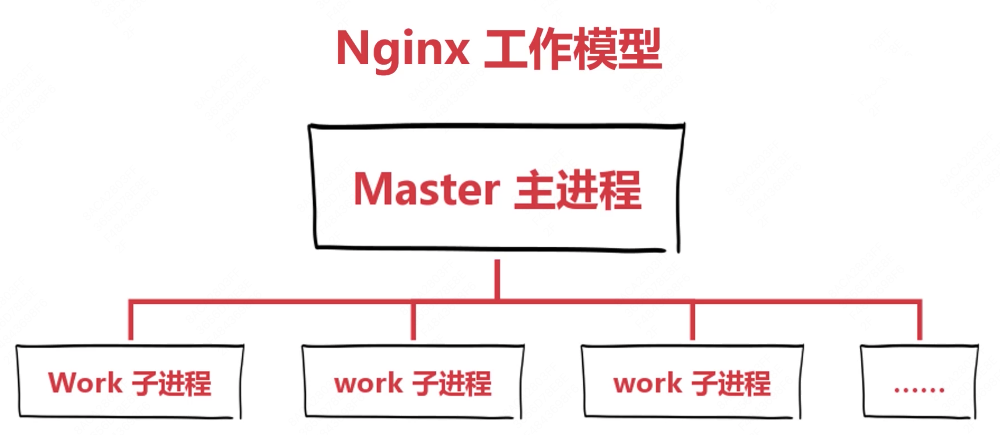
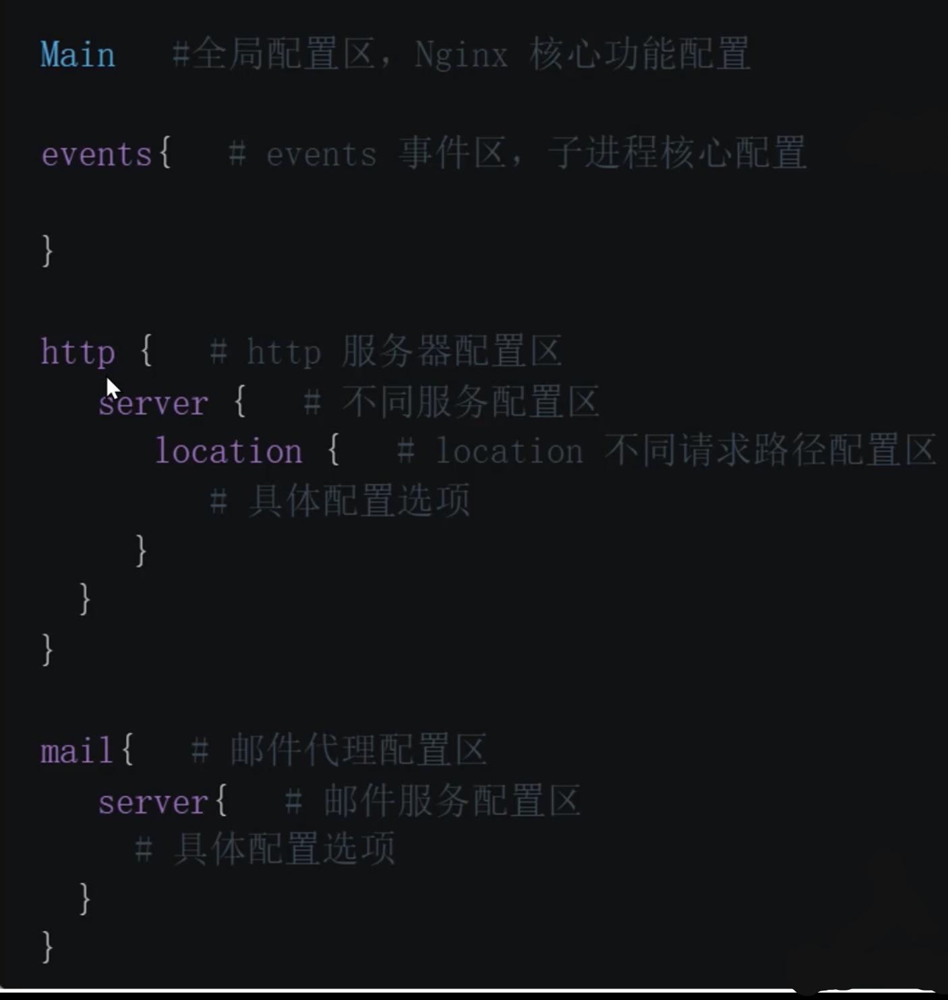

# 1.Nginx工作模型

Master主进程只负责接收，接收过来后做分配给不同的子进程，监控子进程负荷少的进行分配，如果都满了，再开启新的子进程进行处理

https://blog.csdn.net/speedwalkman/article/details/130723412

## 启动

查看Nginx是否正常运行：

netstat -tupln | grep 80

## 停止

nginx  -s  stop

立即停止，所有子进程都杀死

nginx  -s  quit

优雅停止

## 日志

nginx  -s  reopen

重新打开日志文件

## 重新加载配置文件

nginx  -s  reload

重新加载配置文件

nginx -t 

检测

# Nginx配置选项

# Nginx 反向代理

